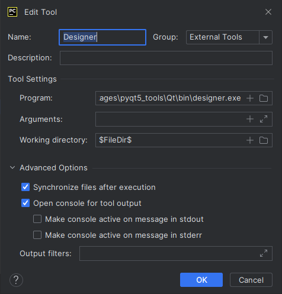
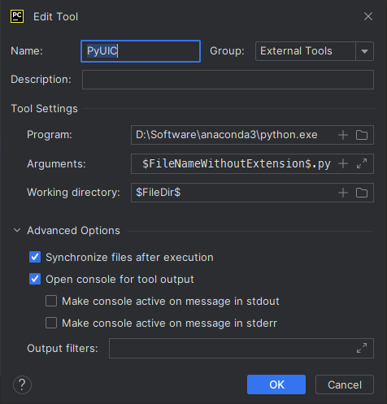
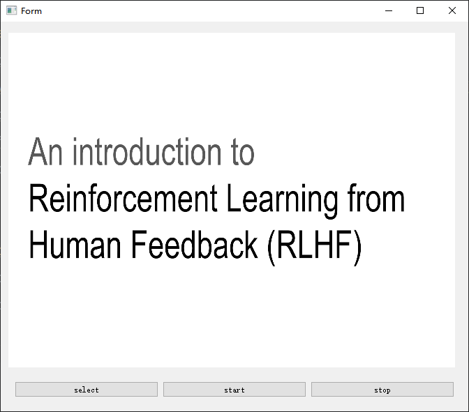

# 任务要求

学习PyQt，使用PyQt绘制一个简单的图形界面，可以打开视频，播放，暂停。

# 任务步骤

1. 配置环境

下载Fork(Git GUI)进行版本管理

```commandline
pip install pyqt5==5.12.3
pip install pyqtwebengine==5.12.1
# 该镜像文件在demo/pkg中
pip install pyqt5_tools-5.12.3.1.6rc1-cp39-none-win_amd64.whl
pip install opencv-python
pip install qimage2ndarray
pip install pyinstaller
```
**配置外部工具**

添加QtDesigner工具

Pycharm->Files->Settings->Tools->External Tools->+

通常QtDesigner的安装路径为`Python39\Lib\site-packages\pyqt5_tools\Qt\bin\designer.exe`

将工作目录设置为`$FileDir$`



添加PyUIC工具

Pycharm->Files->Settings->Tools->External Tools->+

程序设置为`python.exe`

将参数设置为`-m PyQt5.uic.pyuic -o $FileNameWithoutExtension$.py $FileName$`

将工作目录设置为`$FileDir$`



2. 使用QtDesigner绘制界面

3. 使用PyUIC将ui文件转换为py文件

4. 新建py文件，绑定槽函数，添加逻辑代码，`demo`文件夹中为`sample.py`

5. 提交至github

# 掌握知识点

1. QtDesigner基本使用

2. 布局管理器

3. qt信号与槽

4. Fork(Git GUI)基本使用


# 程序示例

